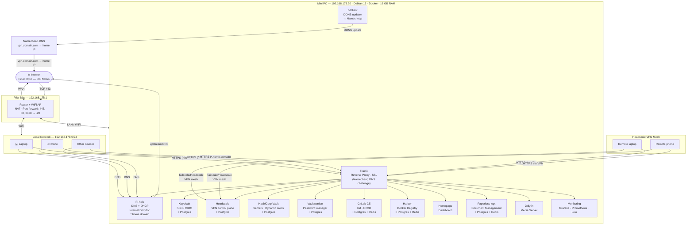

# Architecture

A home network built on a single mini PC running Debian 13 with Docker. All services are managed as Infrastructure as Code (Ansible + Docker Compose). Each service stack is fully self-contained with its own database — stacks can be developed, replaced, or torn down independently.

**Three ports are open on the FritzBox** (TCP 443, TCP 80, UDP 3478), forwarded to the Mini PC. Everything else is LAN/VPN only. Remote access is via Headscale VPN, whose control plane at `vpn.example.com` is kept reachable via Namecheap DDNS. Two other hostnames are also public-facing: `auth.example.com` (Keycloak, so OIDC redirects work from any device) and `daily-mcp.example.com` (daily's IP-allowlisted, rate-limited MCP endpoint for the claude.ai connector). See the Access Model below for the full picture.

---

## Network Diagram



---

## Access Model

| From | How | What's accessible |
|---|---|---|
| Local LAN | Direct (192.168.178.0/24) | All `*.home.example.com` services + Pi-hole at `:8080` |
| Remote (VPN), `group:admins` | Headscale mesh → Mini PC route | Every node and the whole home LAN |
| Remote (VPN), `group:exit-node` | Headscale mesh → Mini PC exit node | As other members, plus the internet through the home connection |
| Remote (VPN), other members | Headscale mesh → Mini PC route | Only the Mini PC's LAN IP on 443 (Traefik) and 53 (Pi-hole); of the apps there, only the ones in `keycloak_open_clients` let them sign in |
| Public internet | TCP 443 → FritzBox → Traefik | `vpn.example.com` (Headscale control plane), `auth.example.com` (Keycloak sign-in), and `daily-mcp.example.com` (daily's MCP endpoint, IP-allowlisted and rate-limited — see the daily2 role README) |

`*.home.example.com` records resolve to the Mini PC LAN IP via Pi-hole and are unreachable from outside the LAN or VPN. Traefik terminates TLS directly — no tunnel or third-party proxy sits between the client and the server.

**Exception:** Keycloak sits at `auth.example.com` (no `.home.` subdomain) and resolves publicly, so OIDC redirects work from any device, including one that is signing in to the VPN for the first time and is therefore on neither the LAN nor the VPN yet. Inside the LAN, Pi-hole resolves it to the Mini PC directly.

**Who may sign in to what.** Every Keycloak client is admin-only by default: the realm's browser flow (`browser-admin-only`) denies users without the realm role `admin` after any sign-in path, including an existing SSO session. Only the clients in `keycloak_open_clients` (`headscale`, `gym-bro`, `account-console`) use the stock flow and are open to every account. A client created later, in the UI or the template, is therefore admin-only until it is listed there. `scripts/check-keycloak-access.py` proves this with real sign-ins; see the keycloak role README.

---

## Service Stacks

Each stack is an independent Docker Compose file with its own database.

### Keycloak (Priority 1 — SSO foundation)
- **Role:** Single sign-on identity provider — all services authenticate through here
- **Auth:** All services use OIDC/OAuth2 against Keycloak. No service has its own user database.
- **Database:** Dedicated Postgres container on an internal-only network
- **Compose:** `services/keycloak/docker-compose.yml`
- **Note:** First service to configure. Create the `homelab` realm and all OIDC clients here before deploying dependent services.

### Traefik + ddclient (Priority 2 — infrastructure)
- **Role:** Reverse proxy for all internal services, wildcard SSL, DDNS updater sidecar
- **SSL:** Let's Encrypt wildcard cert via Namecheap DNS API — DNS challenge allows issuing `*.home.example.com` without exposing internal domains publicly
- **DDNS:** `ddclient` container runs alongside Traefik, updates the `vpn.example.com` A record every 5 minutes via Namecheap's DDNS service
- **Compose:** `services/traefik/docker-compose.yml`

### Headscale (Priority 2 — remote access)
- **Role:** Self-hosted Tailscale control plane, VPN mesh for remote access
- **Public endpoint:** `vpn.example.com` — directly reachable via FritzBox port forward (TCP 443). TLS terminated by Traefik; WebSocket upgrade preserved end-to-end via HTTP/1.1 (`no-h2` TLS option).
- **Auth:** OIDC via Keycloak
- **Database:** Dedicated Postgres container in the same stack
- **Compose:** `services/headscale/docker-compose.yml`

### HashiCorp Vault (Priority 3 — secrets automation)
- **Role:** Secrets management for automation and dynamic credentials (e.g. short-lived DB creds for GitLab CI)
- **Init:** Requires manual `vault operator init` on first deploy — store unseal keys in Vaultwarden immediately
- **Database:** Dedicated Postgres container in the same stack
- **Compose:** `services/hcvault/docker-compose.yml`

### Vaultwarden (Priority 3 — password management)
- **Role:** Self-hosted Bitwarden-compatible password manager
- **Implementation:** Vaultwarden (Rust) — lightweight, single container, compatible with all Bitwarden clients
- **Auth:** OIDC via Keycloak
- **Database:** Dedicated Postgres container in the same stack
- **Compose:** `services/vaultwarden/docker-compose.yml`

### Pi-hole (Priority 4)
- **Role:** Network-wide DNS server + DHCP, ad/tracker blocking, internal DNS for `*.home.example.com`
- **Network mode:** `host` — binds to port 53 and supports DHCP broadcasts, so it is **not** routed through Traefik
- **Internal DNS:** All `*.home.example.com` records point to Mini PC LAN IP — no split-DNS hairpin
- **Upstream DNS:** Cloudflare `1.1.1.1`, Google `8.8.8.8`
- **Compose:** `services/pihole/docker-compose.yml`

### GitLab CE (Priority 4)
- **Role:** Git hosting, CI/CD pipelines, IaC source of truth after bootstrap
- **Auth:** OIDC via Keycloak
- **Database:** Dedicated Postgres + Redis containers in the same stack
- **Runners:** Provisioned separately — no runner ships in this stack
- **Compose:** `services/gitlab/docker-compose.yml`

### Harbor (Priority 4)
- **Role:** Docker image registry — GitLab CI pushes images here
- **Auth:** OIDC via Keycloak
- **Setup:** Uses Harbor's official online installer (not a plain compose file). The `prepare` script generates internal compose config from `harbor.yml`.
- **Database:** Built-in Postgres + Redis managed by the Harbor installer
- **Compose:** `services/harbor/harbor.yml` + `services/harbor/docker-compose.override.yml`

### Homepage (Priority 4)
- **Role:** Homelab dashboard — aggregates all service links, Docker container status, and system widgets
- **Auth:** OIDC via Keycloak
- **Compose:** `services/homepage/docker-compose.yml`

### Paperless-ngx (Priority 4)
- **Role:** Document management — ingest, OCR, tag, and search scanned documents and PDFs
- **Auth:** OIDC via Keycloak; local signups disabled
- **OCR:** German + English; Office documents (docx, xlsx, odt) converted to PDF via Gotenberg/Tika before OCR
- **Database:** Dedicated Postgres + Redis containers in the same stack
- **Compose:** `services/paperless/docker-compose.yml`

### Jellyfin (Priority 4)
- **Role:** Media server — stream locally stored movies, TV shows, and music to any device
- **Auth:** Local accounts by default; OIDC via Keycloak available post-deploy via the SSO plugin
- **Database:** Internal SQLite (no external Postgres or Redis)
- **Media:** Read-only bind mount from `/opt/homelab/media/library` on the host. Uploads stage in the sibling `/opt/homelab/media/incoming`, which is left outside the mount so the scanner never sees a half-transferred file
- **Libraries:** `films`, `series`, `anime/films`, `anime/series`, `documentaries`, `music`, `audiobooks`, `podcasts`, `youtube` — declared in `jellyfin_libraries`, added once each in the admin UI
- **Realtime monitoring:** on for every library, converged by the role through Jellyfin's API — a track written into the tree shows up within seconds instead of at the next scheduled scan
- **Compose:** `services/jellyfin/docker-compose.yml`

### MeTube (Priority 4)
- **Role:** yt-dlp web UI — paste a YouTube URL, get the audio in the Jellyfin music library, the video in the YouTube library, or (with the *Podcast* preset) the audio in the Podcasts library
- **Auth:** None. Reachable only from LAN/VPN, since `*.home.example.com` resolves only in Pi-hole
- **Database:** None — queue state is a JSON file under `services/metube/state`
- **Media:** `/opt/homelab/media` mounted read-write. Finished files go straight to `library/music`, `library/youtube` or `library/podcasts`; intermediate files to `incoming/metube`, inside the same mount so the final move is an atomic rename rather than a copy the scanner could catch half-written
- **Quality:** YouTube's native Opus stream, remuxed not re-encoded
- **Compose:** `services/metube/docker-compose.yml`

### Monitoring (Priority 4)
- **Role:** Observability stack — host + container metrics and log aggregation
- **Components:** Grafana (UI), Prometheus (metrics), Loki (logs), Promtail (Docker log shipper), Node Exporter (host metrics), cAdvisor (container metrics)
- **Auth:** OIDC via Keycloak — login form disabled, all access through Keycloak
- **Traefik metrics:** Prometheus scrapes Traefik's `/metrics` endpoint at `:8082` via the `proxy` Docker network
- **Keycloak metrics:** Prometheus scrapes Keycloak's management port (`keycloak:9000/metrics`) via the `proxy` Docker network, which is not routed by Traefik. Keycloak's event log (sign-ins, token issues, errors) reaches Loki through Promtail. Both feed the Keycloak dashboard.
- **Feed engine metrics:** Prometheus scrapes `library-miniflux:8080/metrics` via the `proxy` Docker network. The engine has no Traefik route, so the container name is the only way to reach it; it answers only for the source networks in its `METRICS_ALLOWED_NETWORKS`, which the `library` role reads from that network
- **Compose:** `services/monitoring/docker-compose.yml`

### MQTT (Priority 4)
- **Role:** Eclipse Mosquitto broker for general-purpose pub/sub — IoT devices, home automation, homelab services
- **Auth:** Username/password (single shared account); anonymous disabled
- **Transport:** TLS-only. MQTT is a raw TCP protocol, so it bypasses Traefik's HTTP routing — Traefik exposes a dedicated `mqtt` entrypoint on `:8883`, and a TCP router terminates TLS with the shared `*.home` wildcard cert before forwarding to Mosquitto's plain `1883` listener (never published to the host)
- **Access:** LAN + VPN only, `mqtt.home.example.com:8883`
- **Compose:** `services/mqtt/docker-compose.yml`

### Gym Bro (Priority 4)
- **Role:** Self-hosted workout tracker — templates, live sessions, progress and PR tracking
- **Source:** [github.com/PhilippTheServer/gym-bro](https://github.com/PhilippTheServer/gym-bro) — one of two services (with `daily`) built from source rather than pulled from a public registry
- **Images:** Built on the Mini PC by the role and published to Harbor as `registry.home.example.com/gym-bro/{backend,frontend}`; the compose stack then pulls them
- **Auth:** OIDC via Keycloak — public client with PKCE, no client secret; the API verifies token signature, issuer and audience against the realm JWKS
- **Routing:** Only the frontend is exposed to Traefik. nginx inside it serves the Angular bundle and reverse-proxies `/api/` to the backend over the internal network, so the browser stays same-origin and no CORS is involved
- **`/export` route (1.2.0):** a read-only export of a user's workout data, reachable
  via Traefik at `https://gym-bro.home.example.com/api/v1/export/workouts` (since
  `gym-bro-frontend` proxies `/api/` to the backend) as well as directly from other
  containers on the `proxy` network. The only gate is a token check: the client id (`azp`)
  must match `EXPORT_CLIENT_ID` (`daily-gymbro-sync`, a confidential Keycloak client); the
  route accepts any `user_id` and serves that user's data. `daily2-backend` (daily)
  calls it as `daily-gymbro-sync`, directly over the proxy network
- **Compose:** `services/gym-bro/docker-compose.yml`

### daily (Priority 6)
- **Role:** daily 2.0, the health and diet journal, deployed by the `daily2` role: an
  Angular frontend, a FastAPI backend (REST `/api/v2` and MCP), its database, a public MCP
  (Model Context Protocol) endpoint for the claude.ai connector, and a sync that pulls
  workout data from `gym-bro`. It replaced daily v1 on 2026-09-30; v1's `daily_db` volume
  is kept on the Mini PC but nothing uses it
- **Source:** [github.com/PhilippTheServer/daily](https://github.com/PhilippTheServer/daily) (named `daily2` until 2026-09-30; v1 is archived as `daily-v1`) — built on the Mini PC and published to Harbor as `registry.home.example.com/daily2/{backend,frontend}` through the shared `harbor_image` role
- **Routing:** `daily2-frontend` (nginx) is the only container Traefik routes at
  `daily.home.example.com`; it serves the Angular bundle and proxies `/api/` to
  `daily2-backend` over the internal network, mirroring `gym-bro`'s same-origin pattern.
  Its Keycloak settings are written into `assets/runtime-config.json` at container start
- **Auth:** OIDC via Keycloak — `daily-app` is a public client with PKCE for the browser
  app; a confidential `daily-mcp` client (PKCE, client secret) issues tokens to the
  claude.ai connector, audience-scoped to `https://daily-mcp.example.com/mcp`.
  Both are admin-only (not in `keycloak_open_clients`), and the backend accepts only
  `OWNER_SUB`. They are v1's clients, kept at the switch-over so the connector did not
  have to sign in again
- **gym-bro sync:** `daily2-backend` gets a client-credentials token from the confidential
  `daily-gymbro-sync` Keycloak client (service account only — no interactive flows) and
  calls `gym-bro-backend`'s `/export` route directly over the shared `proxy` Docker
  network (`GYM_BRO_URL=http://gym-bro-backend:8000`), never through Traefik or the
  public internet
- **Public MCP endpoint:** `daily-mcp.example.com` is routed through Traefik
  directly from the public internet — the only service besides Keycloak and Headscale
  that is. An `ipallowlist` middleware restricts it to Anthropic's outbound range, the
  home LAN, and the Headscale VPN mesh; a `ratelimit` middleware caps it at 20 req/s
  (burst 40). Only `/mcp` and `/.well-known/oauth-protected-resource` are routed —
  nothing else on the backend is exposed
- **Compose:** `services/daily2/docker-compose.yml`

---

### library (Priority 6)
- **Role:** RSS reader: an Angular reading app, a FastAPI shim that gates the API on
  Keycloak, a [Miniflux](https://miniflux.app) feed engine, and the engine's database
- **Source:** [github.com/PhilippTheServer/library](https://github.com/PhilippTheServer/library) — built from source and published to Harbor, same pattern as `gym-bro` and `daily`
- **Images:** Built on the Mini PC by the role and published to Harbor as `registry.home.example.com/library/{backend,frontend}`; the compose stack then pulls them. The engine itself is the upstream `miniflux/miniflux` image
- **Routing:** `library-frontend` (nginx) is the only container Traefik routes at
  `library.home.example.com`; it serves the Angular bundle and proxies `/api/`
  to `library-api` over the internal network, the same same-origin pattern as `daily`
- **The engine has no route.** `library-miniflux` carries no `traefik.enable` label, so
  Traefik never learns it exists — its web UI and its API are reachable only from
  `library-api` over the Docker network. It sits on `proxy` anyway, because `internal`
  has no egress and a feed reader that cannot reach the open internet polls nothing
- **Auth:** OIDC via Keycloak — `library-app` is a public client with PKCE for the
  browser app (admin-only: not listed in `keycloak_open_clients`). `library-api`
  verifies the token's signature, issuer, expiry and `azp` against the realm JWKS, then
  checks its subject against `OWNER_SUB`; a valid token from any other realm account is
  refused with 403. Miniflux's API has no OIDC bearer support, so the shim strips the
  caller's bearer token and reissues the request upstream with HTTP basic auth — the
  engine's credential never reaches a browser
- **Metrics:** `METRICS_COLLECTOR=1` exposes feed poll failures and entry counts for
  Prometheus, which scrapes the engine over the shared `proxy` network. The role reads
  that network's subnet with `docker network inspect` for `METRICS_ALLOWED_NETWORKS`
- **Compose:** `services/library/docker-compose.yml`

---

## Infrastructure as Code

| Layer | Tool | Purpose |
|---|---|---|
| Host provisioning | Ansible | Docker, firewall, system users, directories |
| Secrets | HashiCorp Vault | All credentials in Vault KV v2 (`secret/ansible`); fetched at runtime via `community.hashi_vault` — nothing sensitive in the repo |
| Service deployment | Docker Compose (Jinja2 templates) | Ansible renders and deploys each stack |
| CI/CD | GitLab CI | Re-deploys stacks after bootstrap; authenticates to Vault via AppRole |

### Repo Layout

```
homelab/
├── ansible/
│   ├── inventory/hosts.yml
│   ├── group_vars/all/
│   │   └── vars.yml          # domain, IPs, service versions, HCVault lookups
│   ├── roles/
│   │   ├── common/           # Docker, deploy user, shared network
│   │   ├── ufw/              # UFW firewall rules
│   │   ├── docker-log-limit/ # Docker daemon log rotation
│   │   ├── traefik/          # reverse proxy + SSL + ddclient DDNS
│   │   ├── keycloak/
│   │   ├── headscale/
│   │   ├── hcvault/
│   │   ├── vaultwarden/
│   │   ├── pihole/
│   │   ├── gitlab/
│   │   ├── harbor/
│   │   ├── homepage/
│   │   ├── paperless/
│   │   ├── jellyfin/
│   │   ├── metube/           # yt-dlp web UI writing into the Jellyfin libraries
│   │   ├── monitoring/
│   │   ├── mqtt/              # Eclipse Mosquitto broker (TLS via Traefik TCP router)
│   │   ├── gym-bro/           # workout tracker — builds images and pushes to Harbor
│   │   ├── library/           # RSS reader — Miniflux engine behind a custom UI
│   │   ├── daily2/            # daily (2.0) — builds images, public MCP endpoint
│   │   └── harbor_image/      # shared: build from source on the Mini PC, publish to Harbor
│   └── site.yml
├── services/
│   ├── traefik/
│   ├── keycloak/
│   ├── headscale/
│   ├── hcvault/
│   ├── vaultwarden/
│   ├── pihole/
│   ├── gitlab/
│   ├── harbor/
│   ├── homepage/
│   ├── paperless/
│   ├── jellyfin/
│   ├── metube/
│   ├── monitoring/
│   ├── mqtt/
│   ├── gym-bro/
│   ├── library/
│   └── daily2/
├── docs/
│   ├── architecture.md       # this file
│   ├── bootstrap.md          # step-by-step first deploy
│   ├── ddns.md               # DDNS + TLS cert details
│   ├── vault.md              # Vault CLI, SSH certs, secrets management
│   └── operations.md         # day-to-day ops reference
├── scripts/
│   ├── check-keycloak-access.py  # who may sign in to which client, checked by real sign-ins
│   ├── check-renovate-coverage.py # every version pin is visible to Renovate, checked by a real extract
│   ├── check-pinned-tags.py      # every pinned tag exists, checked against the registry
│   ├── check-vpn-acl.sh          # what a non-admin VPN member can reach, checked from a throwaway node
│   └── check-daily2.sh           # the deployed daily stack (role daily2), checked end to end
├── .github/workflows/
│   ├── renovate.yml              # daily dependency PRs
│   └── ci.yml                    # runs the coverage check on push and PR
├── renovate.json5                # custom regex manager for the group_vars version pins
└── README.md
```

### Bootstrap Order

```
common            → Docker, system users, shared proxy network
ufw               → host firewall (deny-all + explicit allow rules)
docker-log-limit  → daemon log rotation (5 MB per container)
traefik           → SSL + DDNS (infrastructure prerequisite)
keycloak    → SSO (configure realm + OIDC clients before continuing)
headscale   → VPN (remote access live after this step)
hcvault     → secrets automation + store Vault unseal keys in Vaultwarden
vaultwarden → password manager
pihole      → DNS + DHCP
gitlab      → push this repo to GitLab; CI takes over re-deploys
harbor      → registry
homepage    → dashboard
paperless   → document management
jellyfin    → media server
metube      → YouTube audio/video downloader (writes into jellyfin's media tree)
monitoring  → metrics + logs
mqtt        → MQTT broker (TLS + password)
gym-bro     → workout tracker (builds + pushes its images to Harbor first)
library     → RSS reader (builds + pushes its images to Harbor first; the engine has no route)
daily2      → daily (2.0) (builds + pushes its images to Harbor first; public MCP endpoint)
```

---

## Traffic Flows

### Internal browser request
```
Device (LAN or VPN) → DNS query to Pi-hole
Pi-hole → resolves *.home.example.com → Mini PC LAN IP
Device → Traefik :443 → routes by hostname → service container
```

### Remote Headscale registration (new device)
```
Remote device → vpn.example.com
Namecheap DNS → resolves to home IP
FritzBox → port forwards TCP 443 → Traefik → headscale:8080
Headscale → device registered into VPN mesh
```

### Remote access (after VPN connected)
```
Remote device (Headscale VPN) → *.home.example.com
Pi-hole DNS → Mini PC LAN IP → Traefik → service
```

### CI/CD pipeline
```
git push → GitLab → (external) Runner builds image → pushes to Harbor
GitLab CI → AppRole login to Vault → fetch secrets → ansible-playbook → docker compose pull + up → service updated
```

### SSO login
```
User → service → redirect to auth.example.com (Keycloak) → authenticate → token → service
```
